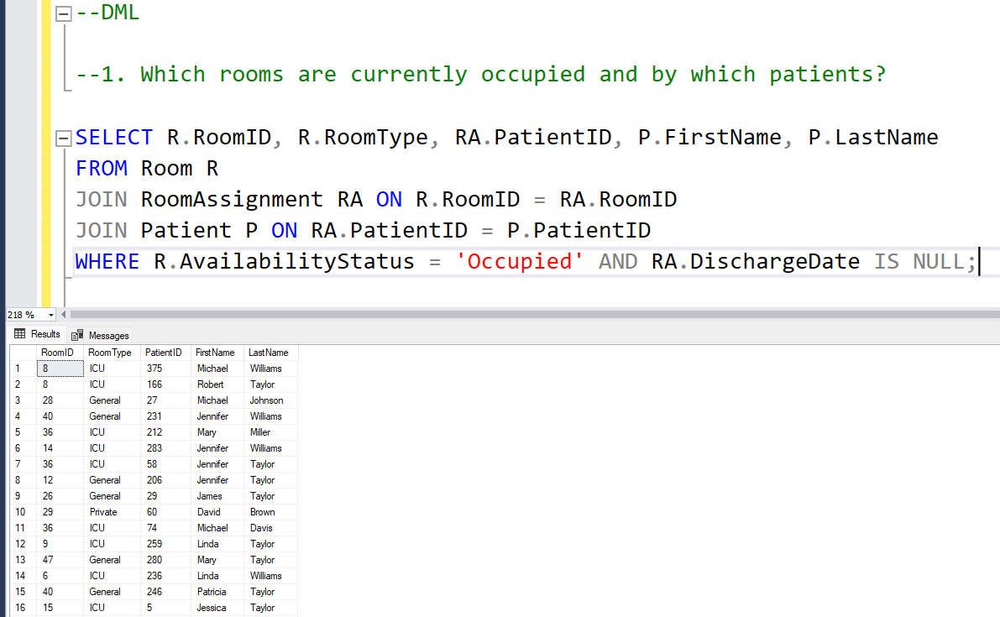

  # main_portfolio_project
This section focuses on showcasing proficiency in data analytics, Performed data cleaning, structured datasets, and wrote optimized SQL queries to extract insights. Created interactive Power BI dashboards showcasing trends and answering business questions, to highlight proficiency in data analytics, visualization, and driving data-informed decisions.

## Project 1: HOSPITAL OPERATIONAL MANAGEMENT ANALYSIS​

### About 

The 'Hospital Operational Management Analysis' project integrates SQL and Power BI to analyze hospital data, improve decision-making, and optimize resource utilization. SQL was used to create the database, define attributes, and populate data. Key business insights, related to room utilization, revenue generation, and medicine patterns, were derived through queries. Power BI dashboards were developed to visualize trends, including patient room turnover, department revenues, and prescription distributions, offering actionable strategies to optimize operations, enhance billing processes, and improve patient satisfaction (business questions) to improve the hospital operational performance. This project showcases expertise in data modeling, SQL analysis, and impactful visualizations.

### Steps 

- **Creating tables (DDL statements):**
  
1. Patient Table
   
o Attributes: PatientID, FirstName, LastName, DateOfBirth, Gender, Address, PhoneNumber, Email, EmergencyContactName, EmergencyContactPhone

o Purpose: Stores demographic details of patients.

2. Doctor Table
   
o Attributes: DoctorID, FirstName, LastName, Specialization, PhoneNumber, Email, DepartmentID, Availability

o Purpose: Stores the details of doctors, including their specialization and contact details.

3. Department Table
   
o Attributes: DepartmentID, DepartmentName, Location, PhoneExtension

o Purpose: Defines different hospital departments such as Cardiology, Neurology, etc.

4. Appointment Table

o Attributes: AppointmentID, PatientID, DoctorID, DepartmentID, AppointmentDate, AppointmentTime, Status (Scheduled, Completed, Cancelled)

o Purpose: Manages patient appointments with doctors.

5. Medical Records Table

o Attributes: RecordID, PatientID, DoctorID, VisitDate, Diagnosis, TreatmentPlan, Prescription

o Purpose: Records all patient medical history, including diagnosis and treatment.

6. Prescription Table
o Attributes: PrescriptionID, RecordID, MedicineID, Dosage, Frequency, Duration
o Purpose: Keeps track of prescribed medicines for each patient's medical record.

7. Medicine Table

o Attributes: MedicineID, MedicineName, Manufacturer, StockQuantity, Price

o Purpose: Stores information about available medicines.

8. Billing Table

o Attributes: BillingID, PatientID, TotalAmount, PaymentStatus (Paid/Unpaid), PaymentDate, PaymentMethod

o Purpose: Handles billing and payments for hospital services.

9. Staff Table

o Attributes: StaffID, FirstName, LastName, Role, DepartmentID, PhoneNumber, Email, ShiftHours

o Purpose: Stores information about non-medical staff (nurses, administrative staff, technicians, etc.).

10.Room Table

o Attributes: RoomID, RoomNumber, DepartmentID, RoomType (General, Private, ICU, etc.), AvailabilityStatus

o Purpose: Maintains information about hospital rooms and their status.

11.RoomAssignment Table

o Attributes: AssignmentID, RoomID, PatientID, AdmissionDate, DischargeDate

o Purpose: Records patient room assignments.

SQL Constraints to Enforce

 Primary Key Constraints: PatientID, DoctorID, DepartmentID, AppointmentID, etc.

 Foreign Key Constraints: Link PatientID in Appointment Table to PatientID in Patient Table.

 Not Null Constraints: For attributes that are essential, like FirstName, LastName, etc.

 Unique Constraints: For attributes like Email, PhoneNumber, RoomNumber, etc.

- Loading data:

Used sql queries to populate data

- **Created DML queries**
Formulated business questions and gathered insights for the business questions through queries.

Business Question 1:

